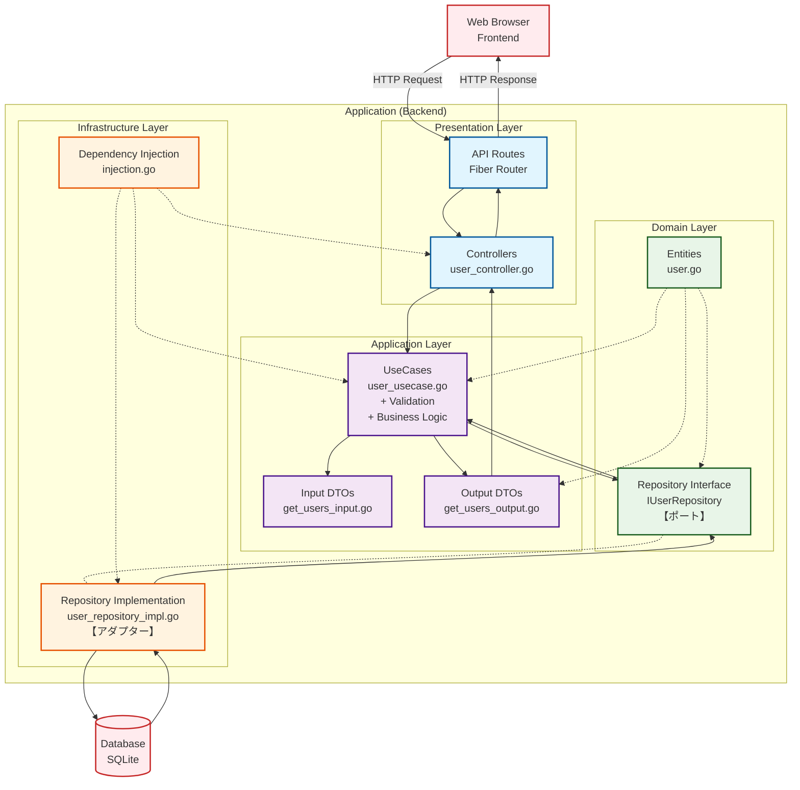
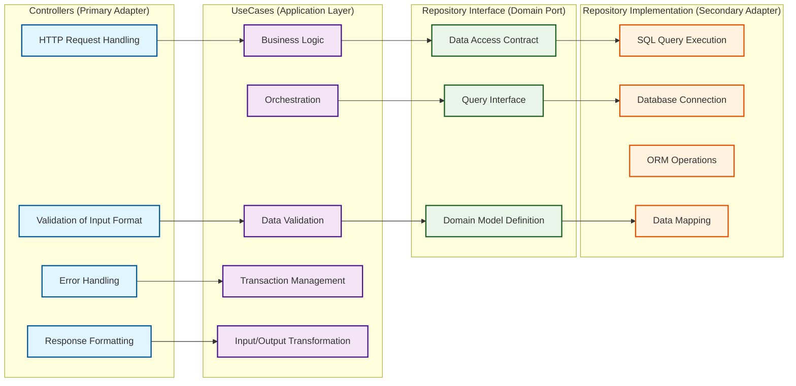
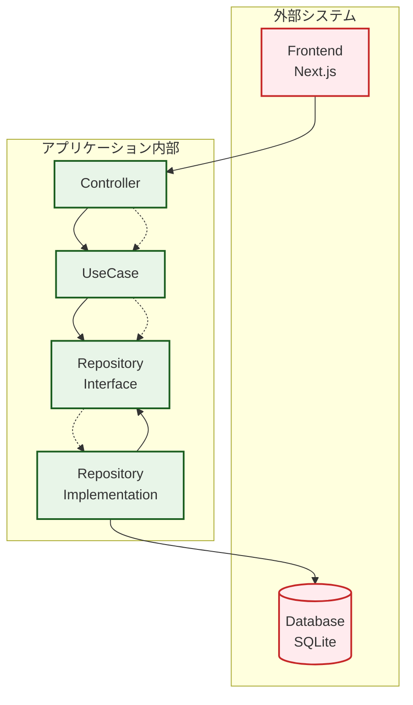
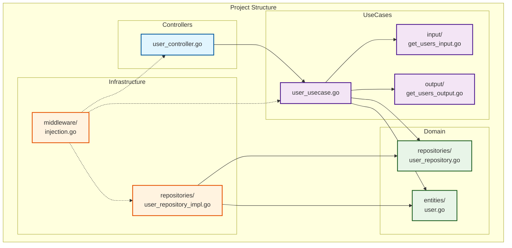

# 現在のアーキテクチャ図

**作成日**: 2025年7月29日  
**プロジェクト**: Pinu  
**アーキテクチャパターン**: ポート&アダプター（ヘキサゴナルアーキテクチャ）

## システム全体のアーキテクチャ図

## レイヤー別の責任詳細図

## 依存性の方向図

## ファイル構造とマッピング

## アーキテクチャの特徴

### ✅ 採用した原則

1. **依存性逆転の原則**: 内側の層は外側の層に依存しない
2. **単一責任の原則**: 各層は明確な責任を持つ
3. **インターフェース分離の原則**: 適切なポートを定義
4. **開放閉鎖の原則**: 実装を変更せずに拡張可能

### 🔧 技術的な決定

1. **ポインタ型の使用**: サービス・リポジトリはポインタ型で統一
2. **インターフェース直接使用**: `*Interface` ではなく `Interface` 型を使用
3. **サービス層の削除**: 不要な抽象化を排除
4. **バリデーションの配置**: ユースケース層でビジネスルールを実装

### 📈 利点

- **テスタビリティ**: 各層を独立してテスト可能
- **保守性**: 責任が明確で変更の影響範囲が限定的
- **拡張性**: 新機能追加時の一貫したパターン
- **理解しやすさ**: シンプルで直感的な構造

この設計により、スケーラブルで保守性の高いGo言語アプリケーションが実現されています。
