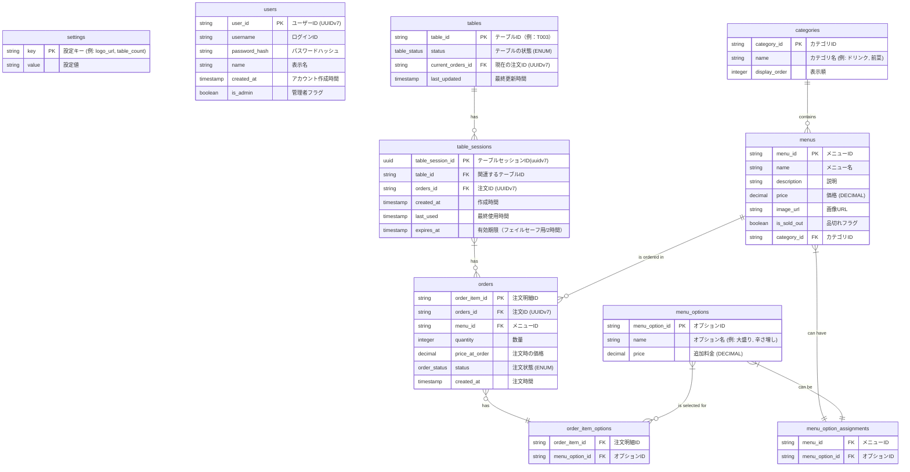

# テーブル設計 (ER図)

## 各テーブルの説明

- **settings**: アプリケーション全体の設定を保存します（例：ロゴのURL、店舗のテーブル総数）。
- **tables**: 店舗内の物理テーブルを表します。テーブルの状態（空席/使用中/会計済み）と現在の注文グループIDを管理します。
- **order_tokens**: 顧客がQRコードを読み取った際に生成されるアクセストークンを管理します。group_idはUUIDv7で発行され、2時間未使用または会計時に無効化されます。
- **categories**: メニューの分類を管理します。
- **menus**: 提供される各メニューの詳細情報を保存します。
- **menu_options**: メニューに追加できるオプション（トッピング、サイズ変更など）を管理します。
- **menu_option_assignments**: どのメニューにどのオプションが利用可能かを示す中間テーブルです。
- **orders**: 各注文に含まれる個別のメニュー項目を管理します。どの注文グループに属し、どのメニューがいくつ注文されたかを記録します。
- **order_item_options**: 注文された各メニュー項目にどのオプションが選択されたかを記録する中間テーブルです。

## データ型 (ENUM)

PostgreSQLのENUM型を利用して、特定カラムの値を制限し、データ整合性を高めます。

- **table_status**: テーブルの状態を管理します。
  - `('available', 'occupied', 'billing')`  `('空席', '使用中', '会計済み')`
- **order_status**: 注文の状態を管理します。
  - `('pending', 'preparing', 'served', 'cancelled')` `('受付待ち', '調理中', '提供済み', 'キャンセル')`

---

- tables.current_orders_id, order_tokens.group_id, orders.orders_idはすべてUUIDv7で統一し、参照整合性を担保します。
- order_tokens.is_activeで論理削除・無効化を明示できます。
- 有効期限切れや会計時の自動クリーンアップ運用を推奨します。
