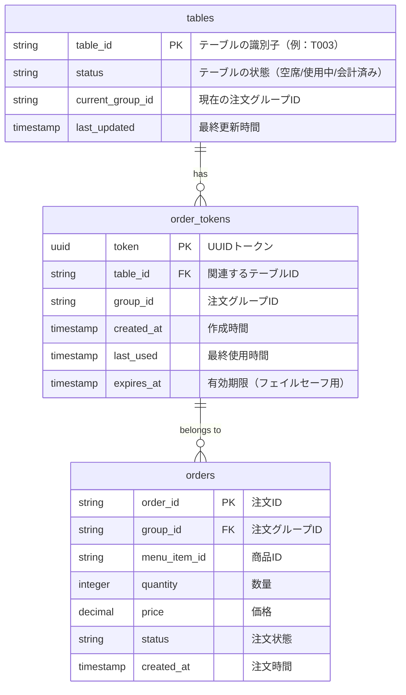

# QRオーダーシステム ER図

以下のER図は、QRオーダーシステムのデータベース設計を表しています。テーブル間の関係と各テーブルのフィールドを示しています。

## テーブル説明

### tables

店舗内の物理テーブルを表します。テーブルの状態（空席/使用中/会計済み）を管理します。

### order_tokens

顧客がQRコードを読み取った際に生成されるアクセストークンを管理します。同じテーブルの複数の顧客は同じgroup_idに関連付けられます。

### orders

顧客からの注文情報を保存します。各注文は特定の注文グループに属します。
