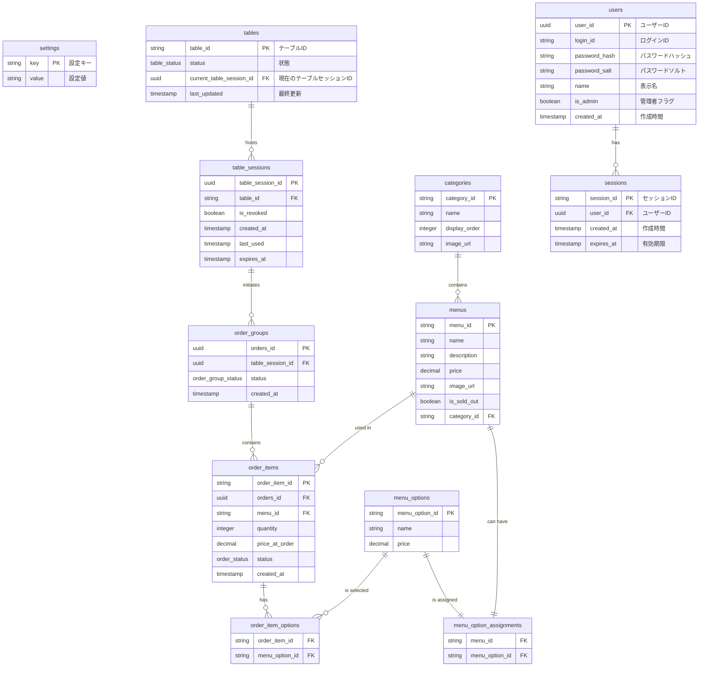

# テーブル設計 (ER図)

```mermaid
erDiagram
    settings {
        string key PK "設定キー"
        string value "設定値"
    }

    users {
        uuid user_id PK "ユーザーID"
        string login_id "ログインID"
        string password_hash "パスワードハッシュ"
        string password_salt "パスワードソルト"
        string name "表示名"
        boolean is_admin "管理者フラグ"
        timestamp created_at "作成時間"
    }

    tables {
        string table_id PK "テーブルID"
        table_status status "状態"
        uuid current_table_session_id FK "現在のテーブルセッションID"
        timestamp last_updated "最終更新"
    }

    table_sessions {
        uuid table_session_id PK
        string table_id FK
        boolean is_revoked
        timestamp created_at
        timestamp last_used
        timestamp expires_at
    }

    order_groups {
        uuid orders_id PK
        uuid table_session_id FK
        order_group_status status
        timestamp created_at
    }

    order_items {
        string order_item_id PK
        uuid orders_id FK
        string menu_id FK
        integer quantity
        decimal price_at_order
        order_status status
        timestamp created_at
    }

    order_item_options {
        string order_item_id FK
        string menu_option_id FK
    }

    categories {
        string category_id PK
        string name
        integer display_order
        string image_url
    }

    menus {
        string menu_id PK
        string name
        string description
        decimal price
        string image_url
        boolean is_sold_out
        string category_id FK
    }

    menu_options {
        string menu_option_id PK
        string name
        decimal price
    }

    menu_option_assignments {
        string menu_id FK
        string menu_option_id FK
    }

    sessions {
        string session_id PK "セッションID"
        uuid user_id FK "ユーザーID"
        timestamp created_at "作成時間"
        timestamp expires_at "有効期限"
    }

    categories ||--o{ menus : "contains"
    menus ||--o{ order_items : "used in"
    menus ||--|| menu_option_assignments : "can have"
    menu_options ||--|| menu_option_assignments : "is assigned"
    menu_options ||--o{ order_item_options : "is selected"
    order_items ||--o{ order_item_options : "has"
    tables ||--o{ table_sessions : "hosts"
    table_sessions ||--o{ order_groups : "initiates"
    order_groups ||--o{ order_items : "contains"
    users ||--o{ sessions : "has"
```

## 各テーブルの説明

- **settings**: アプリケーション全体の設定を保存します（例：ロゴのURL、店舗のテーブル総数）。
- **tables**: 店舗内の物理テーブルを表します。テーブルの状態（空席/使用中/会計待ち）と現在のテーブルセッションID（current_table_session_id）を管理します。
- **table_sessions**: 各テーブルのセッション（QR入店〜会計・有効期限まで）を表します。is_revoked, last_used, expires_at を持ちます。
- **order_groups**: セッション配下の注文グループです。status で open/closed/cancelled を管理します。
- **categories**: メニューの分類を管理します。
- **menus**: 提供される各メニューの詳細情報を保存します。
- **menu_options**: メニューに追加できるオプション（トッピング、サイズ変更など）を管理します。
- **menu_option_assignments**: どのメニューにどのオプションが利用可能かを示す中間テーブルです。
- **order_items**: 各注文グループに含まれるメニュー項目を管理します。どの注文グループに属し、どのメニューがいくつ注文されたかを記録します。
- **order_item_options**: 注文された各メニュー項目にどのオプションが選択されたかを記録する中間テーブルです。
- **users**: 従業員・管理者などのユーザーを表します。
- **sessions**: ユーザーのログインセッション情報を管理します（session_id は string）。

## データ型 (ENUM)

PostgreSQL の ENUM 型で特定カラムの値を制限し、整合性を高めます。

- **table_status**: テーブルの状態を管理します。
  - `('available', 'occupied', 'billing')`  `('空席', '使用中', '会計済み')`
- **order_status**: 注文の状態を管理します。
  - `('pending', 'preparing', 'served', 'cancelled')` `('受付待ち', '調理中', '提供済み', 'キャンセル')`
- **order_group_status**: 注文グループの状態を管理します。
  - `('open', 'closed', 'cancelled')` `('オープン', 'クローズ', 'キャンセル')`

---

- tables.current_table_session_id と order_groups.orders_id は UUID で参照整合性を担保します。
- 有効期限切れや会計時には、同一トランザクションで tables.current_table_session_id を NULL にし、当該セッション配下の open な order_groups を closed に更新する運用を推奨します。
