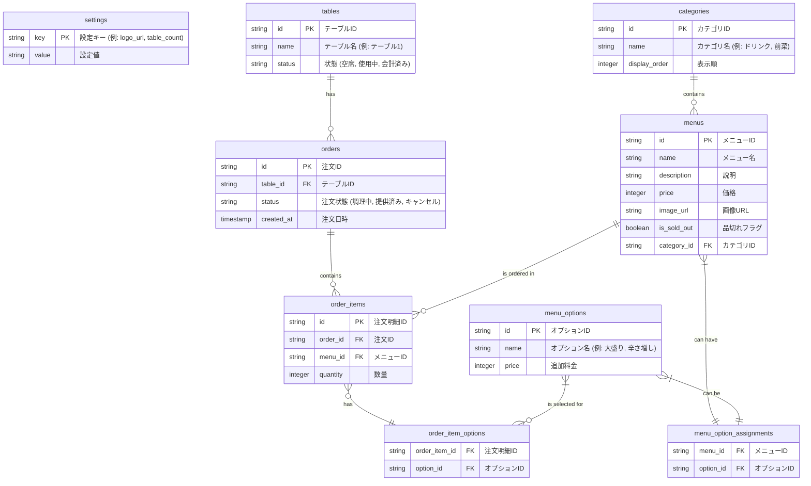

# テーブル設計 (ER図)

機能一覧から予測されるデータベースのテーブル設計を以下に示します。

## 各テーブルの説明

- **settings**: アプリケーション全体の設定を保存します（例：ロゴのURL、店舗のテーブル総数）。
- **tables**: 店舗内の物理的なテーブルとその状態を管理します。
- **categories**: メニューの分類を管理します。
- **menus**: 提供される各メニューの詳細情報を保存します。
- **menu_options**: メニューに追加できるオプション（トッピング、サイズ変更など）を管理します。
- **menu_option_assignments**: どのメニューにどのオプションが利用可能かを示す中間テーブルです。
- **orders**: 顧客からの注文単位を管理します。どのテーブルからの注文かが記録されます。
- **order_items**: 各注文に含まれる個別のメニュー項目を管理します。
- **order_item_options**: 注文された各メニュー項目にどのオプションが選択されたかを記録する中間テーブルです。
