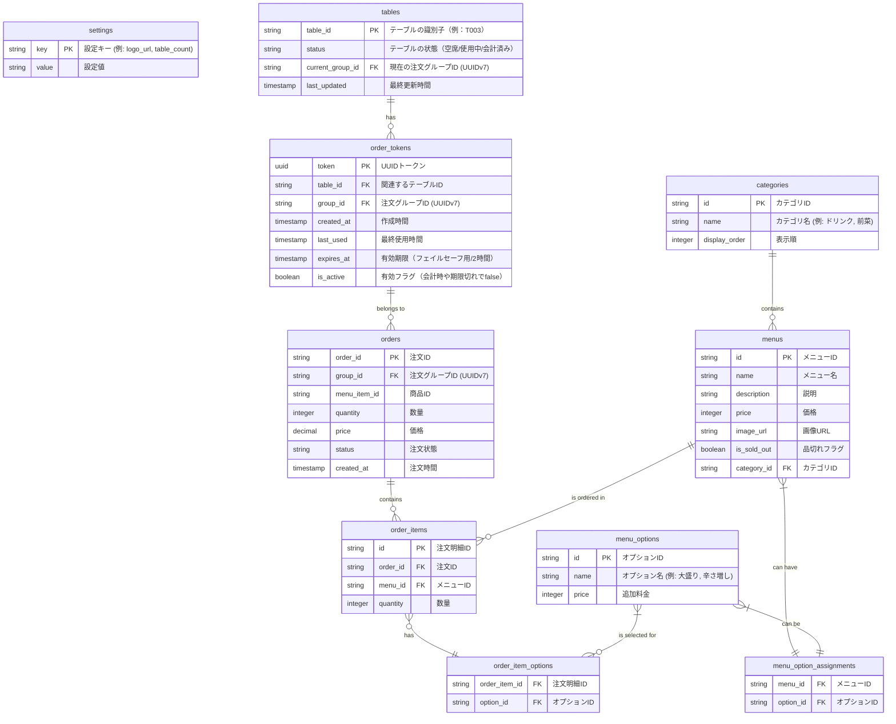

# テーブル設計 (ER図)

## 各テーブルの説明

- **settings**: アプリケーション全体の設定を保存します（例：ロゴのURL、店舗のテーブル総数）。
- **tables**: 店舗内の物理テーブルを表します。テーブルの状態（空席/使用中/会計済み）と現在の注文グループIDを管理します。
- **order_tokens**: 顧客がQRコードを読み取った際に生成されるアクセストークンを管理します。group_idはUUIDv7で発行され、2時間未使用または会計時に無効化されます。
- **orders**: 顧客からの注文情報を保存します。各注文は特定の注文グループ（group_id）に属します。
- **categories**: メニューの分類を管理します。
- **menus**: 提供される各メニューの詳細情報を保存します。
- **menu_options**: メニューに追加できるオプション（トッピング、サイズ変更など）を管理します。
- **menu_option_assignments**: どのメニューにどのオプションが利用可能かを示す中間テーブルです。
- **order_items**: 各注文に含まれる個別のメニュー項目を管理します。
- **order_item_options**: 注文された各メニュー項目にどのオプションが選択されたかを記録する中間テーブルです。

---

- tables.current_group_id, order_tokens.group_id, orders.group_idはすべてUUIDv7で統一し、参照整合性を担保します。
- order_tokens.is_activeで論理削除・無効化を明示できます。
- 有効期限切れや会計時の自動クリーンアップ運用を推奨します。
