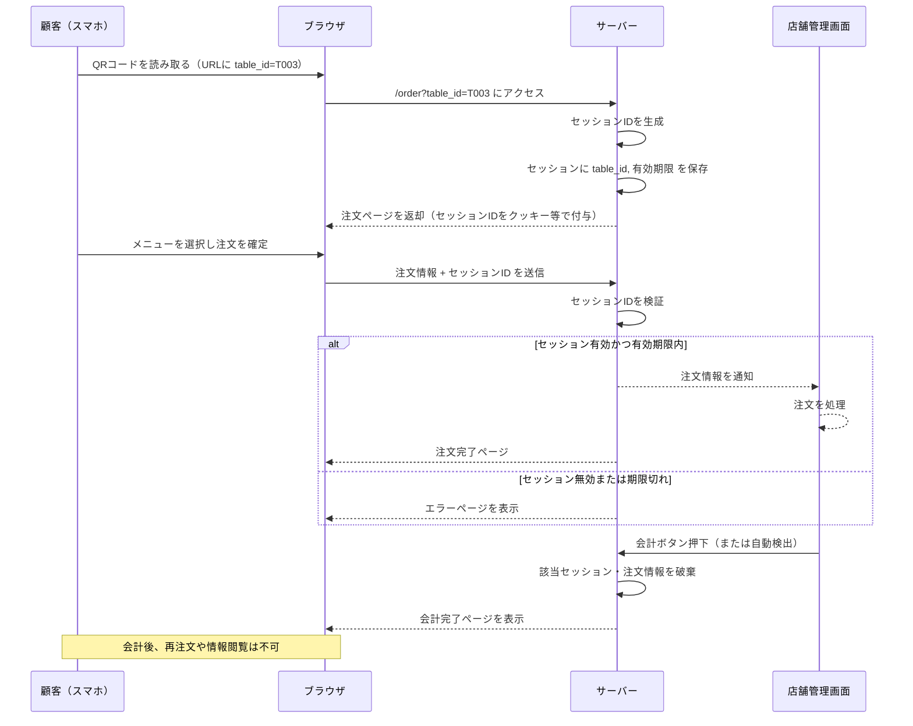

# 注文フロー（セッションID認証のみ）

今回のシステムでは、セッションIDを使用して認証を行います。トークンは使用せず、セッションIDのみで注文の認証を行います。以下はそのフローです。

## 選定理由

注文はステートフルな操作であるためセッションIDを選択。
セッションIDはサーバー側で管理されるため、クライアント側のトークンを扱う必要がなく、セキュリティ上のリスクを軽減できます。

### セッションIDの有効期間について

店舗ごとに異なるため、店舗側で設定できるようにします。例えば、店舗の営業時間や特定のイベントに応じて、セッションIDの有効期限を調整することができます。
