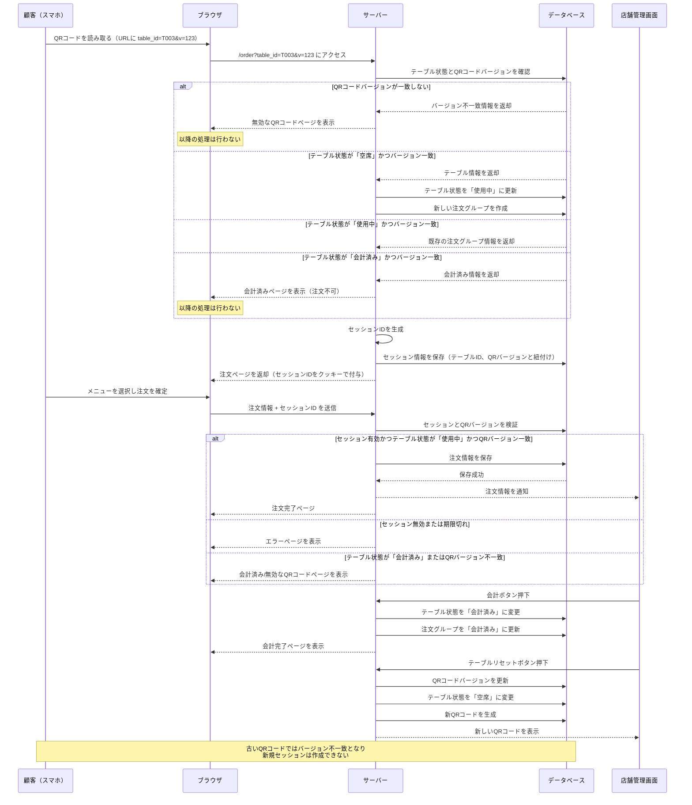

# 改良版セッション管理設計（改善版）

## 基本方針

QRオーダーシステムのセッション管理において最も重要な要件は以下の2点です：

1. **複数人が同じQRコードを読み取っても破綻しないこと**
2. **会計後は同じURLを叩いても注文できないこと**

これらの要件を満たすために、テーブル状態とセッション管理を分離した設計を採用します。

## データベース設計

### テーブル構造

```
テーブル: table_status
- table_id (PK): テーブルの識別子（例：T003）
- status: テーブルの状態（空席/使用中/会計済み）
- current_order_group_id: 現在の注文グループID
- last_updated: 最終更新時間
- available_until: 利用可能期限（店舗設定による）
- qr_code_version: QRコードのバージョン（テーブルリセット時に更新）

テーブル: sessions
- session_id (PK): セッションの識別子
- table_id (FK): 関連するテーブルID
- qr_code_version: セッション作成時のQRコードバージョン
- device_fingerprint: デバイス識別情報（オプション）
- created_at: セッション作成時間
- last_access: 最終アクセス時間
- expires_at: セッション有効期限

テーブル: order_groups
- order_group_id (PK): 注文グループID
- table_id (FK): 関連するテーブルID
- qr_code_version: 作成時のQRコードバージョン
- status: 状態（進行中/会計済み）
- created_at: 作成時間
- completed_at: 会計完了時間

テーブル: orders
- order_id (PK): 注文ID
- order_group_id (FK): 注文グループID
- menu_item_id: 注文された商品ID
- quantity: 数量
- price: 価格
- status: 注文状態（受付/調理中/提供済み）
- created_by_session_id: 注文したセッションID
- created_at: 注文時間
```

## セッション管理フロー（改善版）



## QRコードバージョン管理

* **問題点の解決策**: テーブルごとに「QRコードバージョン」を管理
* テーブルをリセットする際に、QRコードバージョンを更新（インクリメント）
* QRコード自体にバージョン情報を埋め込む（例：`table_id=T003&v=123`）
* セッション作成時にQRコードバージョンを記録し、常に検証

## 複数人での同時利用

* 同じテーブルIDと同じQRコードバージョンに対して複数のセッションが存在可能
* すべてのセッションは同じ注文グループに紐づく
* どのセッションからでも注文情報を閲覧・追加可能
* リアルタイム更新（WebSocketなど）を使って全セッションに注文情報を同期

## 会計後のアクセス制御

* 会計処理後はテーブル状態が「会計済み」になる
* 既存のセッションでアクセスしても注文不可の状態になる
* 新規にQRコードを読み取っても「会計済み」と表示される
* テーブルリセット時には必ずQRコードバージョンを更新し、新しいQRコードを生成
* **重要**: 古いQRコードでアクセスした場合、バージョン不一致となり注文不可

## セキュリティ対策

* セッションIDはランダムな十分な長さの文字列を使用
* セッションIDはHTTPS経由でSecure属性付きCookieとして送信
* 定期的なセッション有効期限チェックを実施
* テーブル状態とQRコードバージョンの変更はサーバー側のみで可能

## 実装上の考慮点

* セッションの有効期限は店舗ごとに設定可能
* バックグラウンドジョブでの定期的なセッションクリーンアップ
* 注文情報をリアルタイムに同期するためのWebSocketサーバー
* 障害発生時のリカバリー手段として、セッション・注文情報のログを保持
* テーブルリセット時に新しいQRコードを印刷またはディスプレイに表示する機能
