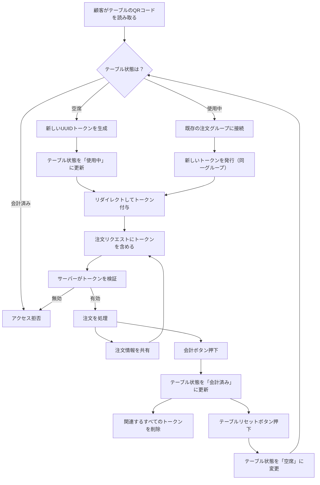

# セッション管理フロー図（最終設計）

```mermaid
flowchart TD
    A[顧客がテーブルのQRコードを読み取る] --> B{テーブル状態は？}
    B -- "空席" --> C[新しいUUIDトークンを生成]
    C --> D[テーブル状態を「使用中」に更新]
    D --> E[リダイレクトしてトークン付与]
    B -- "使用中" --> F[既存の注文グループに接続]
    F --> G[新しいトークンを発行（同一グループ）]
    G --> E
    B -- "会計済み" --> H[アクセス拒否]
    E --> I[注文リクエストにトークンを含める]
    I --> J[サーバーがトークンを検証]
    J -- "有効" --> K[注文を処理]
    J -- "無効" --> H
    K --> L[注文情報を共有]
    L --> I
    K --> M[会計ボタン押下]
    M --> N[テーブル状態を「会計済み」に更新]
    N --> O[関連するすべてのトークンを削除]
    N --> P[テーブルリセットボタン押下]
    P --> Q[テーブル状態を「空席」に変更]
    Q --> B
```

- 各ノードは主要な処理・状態遷移を表しています。
- 「空席」→「使用中」→「会計済み」→「空席」のサイクルを明示しています。
- トークン発行・検証・削除の流れも含めています。
