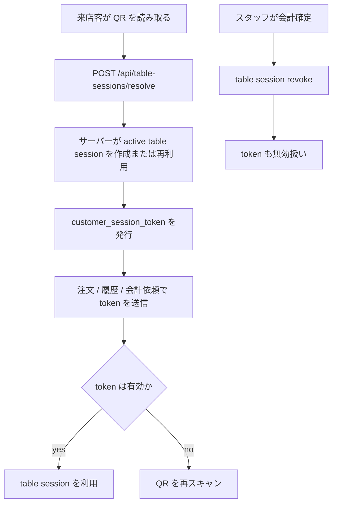

```mermaid
flowchart TD
    A[来店客が QR を読み取る] --> B[POST /api/table-sessions/resolve]
    B --> C[サーバーが active table session を作成または再利用]
    C --> D[customer_session_token を発行]
    D --> E[注文 / 履歴 / 会計依頼で token を送信]
    E --> F{token は有効か}
    F -- yes --> G[table session を利用]
    F -- no --> H[QR を再スキャン]
    I[スタッフが会計確定] --> J[table session revoke]
    J --> K[token も無効扱い]
```