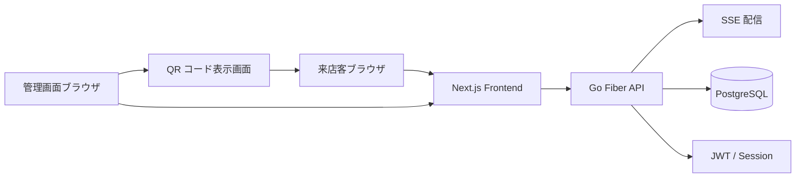
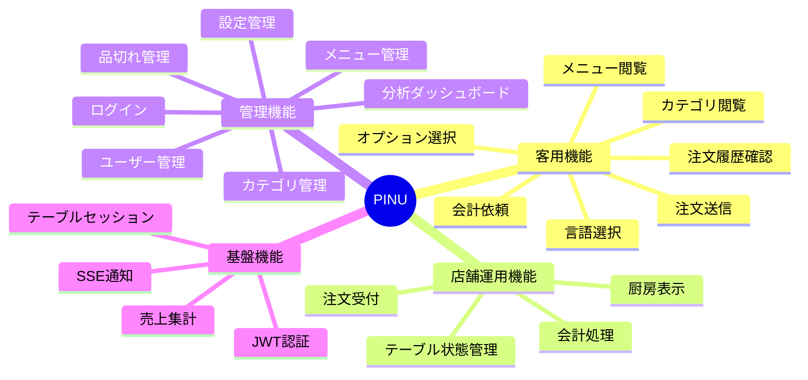
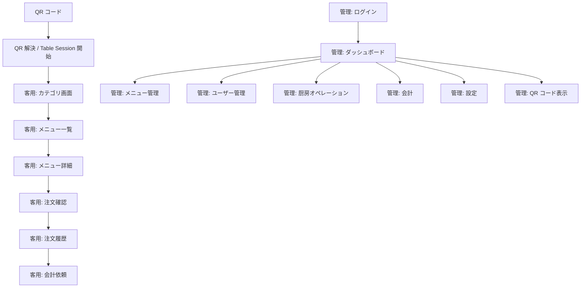
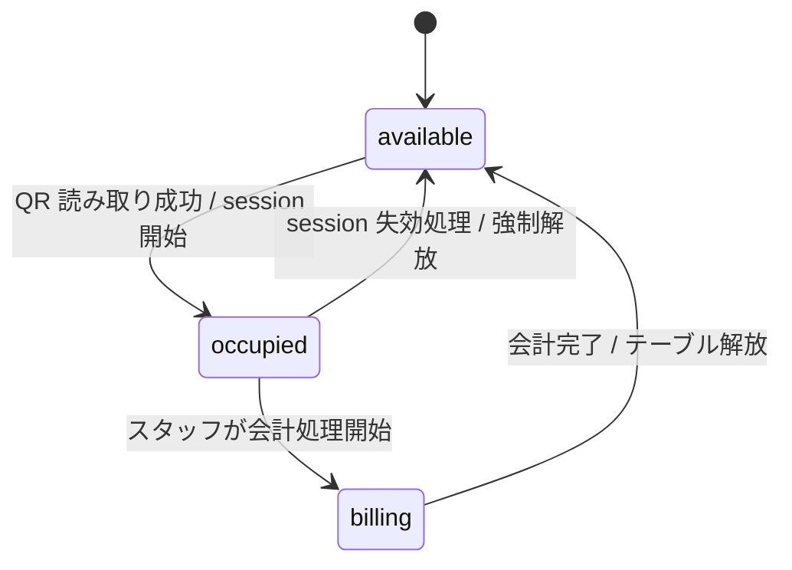
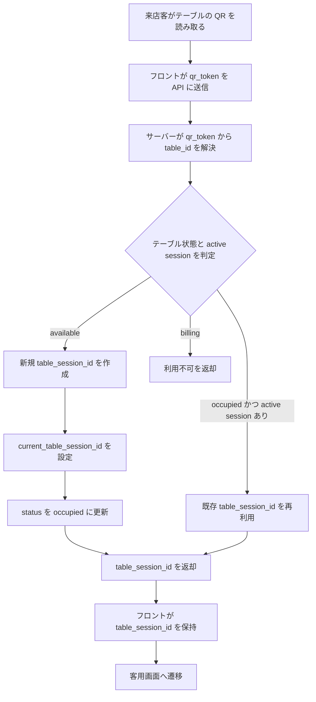
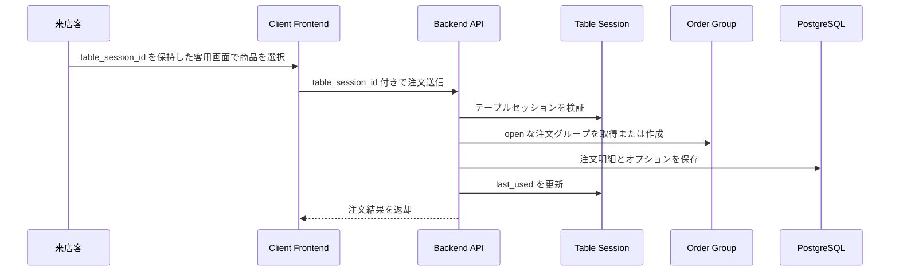
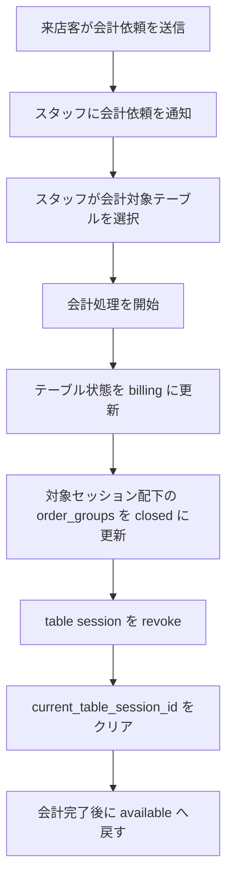
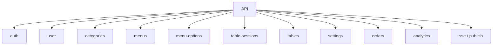
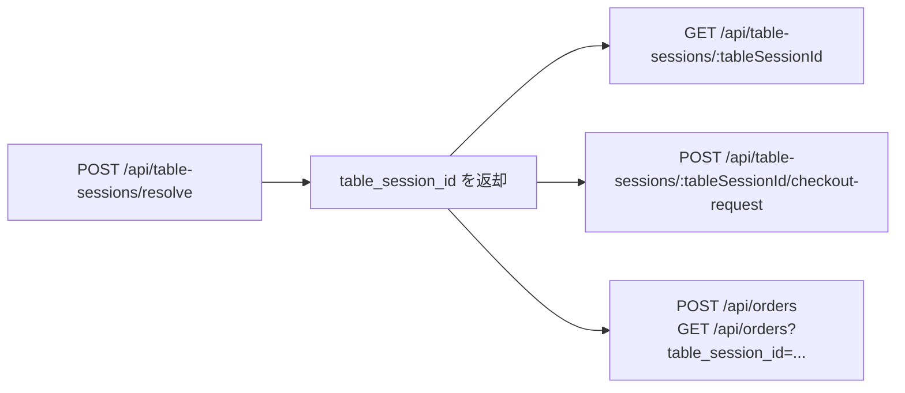
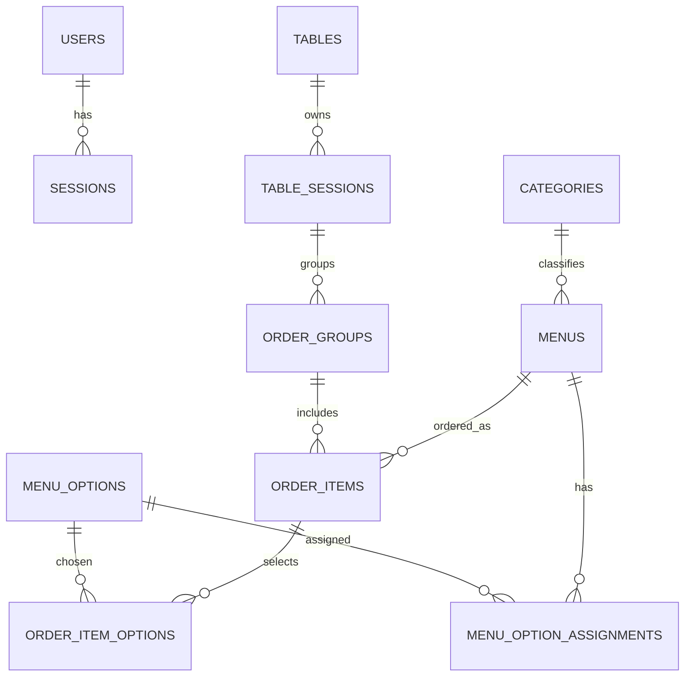

# PINU システム仕様書

## 1. システム概要

PINU は、小規模飲食店向けの QR オーダーシステムです。  
来店客はテーブルごとの QR コードから注文画面にアクセスし、店側は管理画面から注文受付・会計・メニュー管理・分析を行います。

### 1.1 解決する課題

- 店主が客席を巡回して注文を取る負担を減らす
- 注文到着を即時に把握できるようにする
- テーブルごとの利用状況と会計状態を一元管理する
- メニュー更新や売上確認を店側で完結できるようにする

### 1.2 提供チャネル

- 客用画面（スマートフォン想定）
- 管理画面（店舗スタッフ向け）
- 厨房オペレーション画面
- 会計画面
- QR コード表示画面

## 2. 利用者と権限

| 利用者 | 主な目的 | 主な操作 |
| --- | --- | --- |
| 来店客 | 注文と会計依頼 | カテゴリ閲覧、メニュー選択、オプション選択、注文履歴確認、会計依頼 |
| 店舗スタッフ | 店舗運営 | 注文確認、会計処理、テーブル状態更新 |
| 管理者 | 設定・管理 | ログイン、ユーザー管理、メニュー管理、カテゴリ管理、設定変更、分析確認 |

## 3. システム構成



### 3.1 採用技術スタック

| レイヤー | 技術 |
| --- | --- |
| フロントエンド | Next.js / React / TypeScript / pnpm |
| UI | Tailwind CSS / workspace UI package |
| バックエンド | Go / Fiber |
| データアクセス | Bun |
| データベース | PostgreSQL |
| 認証 | JWT (HS256) + Refresh Session |
| 通知 | SSE |
| 開発運用 | Task / Docker Compose |

### 3.2 バックエンド構成方針

- DI コンテナで依存解決を行う
- `routes -> handlers -> usecases -> repositories` の責務分離を維持する
- 複数更新が必要な処理は `UnitOfWork.Run` でトランザクション管理する

## 4. 機能仕様

### 4.1 機能マップ



### 4.2 客用機能

1. QR コード読み取り時にテーブルセッションを開始または再利用し、客用画面へ遷移できる
2. カテゴリ単位でメニューを閲覧できる
3. メニュー詳細画面で商品情報を確認できる
4. メニューオプションを選択して注文できる
5. 注文履歴を確認できる
6. 会計依頼を送信できる

### 4.3 管理機能

1. 管理者はログインできる
2. ユーザーの登録・更新・削除・一覧表示ができる
3. カテゴリの登録・更新・削除・一覧表示ができる
4. メニューの登録・更新・削除・カテゴリ別表示ができる
5. メニューオプションの登録・更新・削除ができる
6. 店舗設定を参照・更新できる
7. KPI、日次売上、カテゴリ別売上、トップメニューを確認できる

### 4.4 店舗運用機能

1. 注文をリアルタイムに受信できる
2. 厨房画面で注文一覧を確認できる
3. 会計対象テーブルを一覧できる
4. テーブル単位で会計処理を実行できる
5. テーブル状態を `available / occupied / billing` で管理できる

## 5. 画面仕様

### 5.1 画面遷移概要



### 5.2 画面一覧

| 区分 | 画面 |
| --- | --- |
| 客用 | 言語選択、カテゴリ一覧、メニュー一覧、メニュー詳細、注文確認、注文履歴、会計依頼 |
| 管理 | ログイン、ダッシュボード、ユーザー管理、メニュー管理、カテゴリ管理、設定 |
| 店舗運用 | 厨房オペレーション、会計、テーブル状態管理、QR コード表示 |

## 6. 業務フロー

### 6.1 テーブル状態遷移



### 6.2 QR / テーブルセッション開始フロー



### 6.3 注文フロー



### 6.4 会計フロー



## 7. 認証・セッション仕様

### 7.1 管理者認証

- 管理画面はログインを必要とする
- アクセストークンは JWT を使用する
- リフレッシュトークンはサーバー側セッションとして保持する
- セッションは失効・削除できる

### 7.2 テーブルセッション

- QR コードは物理テーブルに固定配置する識別子 `qr_token` を保持し、`tables.qr_token` に一意に保存する
- `qr_token` は来店単位のセッションではなく、サーバーが `table_id` と `table_session_id` を解決するために使う
- QR 読み取り成功時に有効なテーブルセッションが存在しない場合、新しい `table_session_id` を作成し、同時にテーブル状態を `occupied` に更新する
- QR 読み取り成功時に同一テーブルの有効なテーブルセッションが存在する場合、既存の `table_session_id` を返却し、来店客は同一セッションに合流する
- テーブルごとに過去の `table_session_id` は複数持てるが、同時に有効なセッションは 1 件のみとする
- テーブル状態が `billing` の場合、新規のセッション開始および途中参加を拒否する
- `table_session_id` はフロントエンドが保持し、注文、注文履歴、会計依頼のリクエストに利用する
- 客用の追加アクセストークンは発行せず、`table_session_id` をそのまま客用 API の識別子として利用する
- テーブルセッションの有効性は `is_revoked = false`、`expires_at > now`、および対象テーブルが `billing` 以外であることを条件に判定する
- 専用の heartbeat API は設けず、`last_used` はテーブルセッション参照、注文登録、注文履歴取得、会計依頼などの成功時に更新する
- `expires_at` はセッションのハード期限として扱い、期限切れ時は QR の再読み取りで再参加する
- 来店客の会計依頼はスタッフへの通知イベントであり、`table_session_id` の revoke 条件ではない
- 会計確定時に対象 `table_session_id` を revoke し、`current_table_session_id` をクリアする

## 8. API 仕様概要

### 8.1 API リソース

| リソース | 主な役割 |
| --- | --- |
| `/api/auth` | ログイン、ログアウト、トークン更新、セッション失効 |
| `/api/user` | ユーザー管理 |
| `/api/categories` | カテゴリ管理 |
| `/api/menus` | メニュー管理 |
| `/api/menu-options` | メニューオプション管理 |
| `/api/table-sessions` | QR 解決、テーブルセッション開始・再参加・参照、会計依頼 |
| `/api/tables` | テーブル管理、会計処理 |
| `/api/settings` | 設定管理 |
| `/api/orders` | 注文登録、注文一覧取得 |
| `/api/analytics` | KPI、売上分析、メニュー分析 |
| `/api/sse` | リアルタイム通知受信 |

### 8.2 API 構成図



### 8.3 Table Sessions API 契約



#### 8.3.1 セッション解決 API

`POST /api/table-sessions/resolve`

QR コードから取得した `qr_token` を active な `table_session_id` に解決する。対象テーブルが `available` の場合はセッションを新規作成し、`occupied` の場合は既存セッションに合流する。

**リクエスト**

```json
{
  "qr_token": "qr_opaque_token"
}
```

**レスポンス**

```json
{
  "table_session_id": "018f9d7c-6b2a-7f4e-8b23-9f0d1d2a3b4c",
  "table_id": "T01",
  "table_status": "occupied",
  "resolution": "created",
  "is_active": true,
  "created_at": "2026-04-29T12:00:00Z",
  "last_used": "2026-04-29T12:00:00Z",
  "expires_at": "2026-04-29T15:00:00Z"
}
```

**結果コード**

| HTTP | 条件 |
| --- | --- |
| `200` | 新規作成または既存セッション再利用に成功 |
| `404` | `qr_token` に対応するテーブルが存在しない |
| `409` | 対象テーブルが `billing` で利用不可 |

#### 8.3.2 セッション参照 API

`GET /api/table-sessions/:tableSessionId`

現在保持している `table_session_id` がまだ利用可能かを確認する。画面再読み込み時や復帰時の整合確認に使う。

**レスポンス**

```json
{
  "table_session_id": "018f9d7c-6b2a-7f4e-8b23-9f0d1d2a3b4c",
  "table_id": "T01",
  "table_status": "occupied",
  "is_active": true,
  "created_at": "2026-04-29T12:00:00Z",
  "last_used": "2026-04-29T12:15:00Z",
  "expires_at": "2026-04-29T15:00:00Z"
}
```

**結果コード**

| HTTP | 条件 |
| --- | --- |
| `200` | セッションが存在し利用可能 |
| `404` | `table_session_id` が存在しない |
| `410` | セッションが revoke 済みまたは期限切れ |

#### 8.3.3 会計依頼 API

`POST /api/table-sessions/:tableSessionId/checkout-request`

来店客が会計依頼を送信する。これはスタッフ向け通知イベントであり、セッションを終了させない。

**リクエスト**

```json
{}
```

**レスポンス**

```json
{
  "table_session_id": "018f9d7c-6b2a-7f4e-8b23-9f0d1d2a3b4c",
  "request_status": "accepted",
  "requested_at": "2026-04-29T12:20:00Z"
}
```

同一 active session から重複依頼を受けた場合は、通知を重複送信せず `request_status = "already_requested"` を返してよい。

**結果コード**

| HTTP | 条件 |
| --- | --- |
| `202` | 会計依頼の受付に成功 |
| `404` | `table_session_id` が存在しない |
| `410` | セッションが revoke 済みまたは期限切れ |

#### 8.3.4 補足ルール

- `POST /api/orders` と `GET /api/orders?table_session_id=...` は既存どおり `table_session_id` を利用する
- `table_session_id` を受け取る API は成功時に `last_used` を更新してよい
- `resolve` は同一テーブルへの同時アクセス時でも active session が 1 件になるよう排他制御する
- 会計確定は客用 API ではなく `POST /api/tables/:id/checkout` で行う

## 9. データ仕様

### 9.1 主要エンティティ



### 9.2 主要テーブル

| テーブル | 用途 |
| --- | --- |
| `users` | 管理ユーザー情報 |
| `sessions` | 管理ユーザーのリフレッシュセッション |
| `categories` | カテゴリ情報 |
| `menus` | メニュー情報 |
| `menu_options` | オプション情報 |
| `tables` | 物理テーブル、固定 QR 識別子、現在状態 |
| `table_sessions` | テーブル利用セッション |
| `order_groups` | セッション単位の注文グループ |
| `order_items` | 注文明細 |
| `order_item_options` | 注文時に選択したオプション |
| `settings` | 店舗設定 |

### 9.3 状態管理

| 種別 | 値 |
| --- | --- |
| テーブル状態 | `available`, `occupied`, `billing` |
| 注文状態 | `pending`, `preparing`, `served`, `cancelled` |
| 注文グループ状態 | `open`, `closed`, `cancelled` |

## 10. 非機能要件

### 10.1 操作性

- 高齢の店主でも直感的に操作できる UI とする
- 注文から会計までの操作手順は短く保つ
- 画面ごとの情報量は過多にしない

### 10.2 性能・拡張性

- 注文通知はリアルタイムに反映する
- 集計処理は分析用ビューの利用を前提とする
- 注文、会計、テーブル更新は整合性を保つ

### 10.3 セキュリティ

- 認証は JWT の署名検証を必須とする
- パスワードはハッシュ化して保存する
- シークレットは環境変数で管理する
- SQL はクエリビルダ経由で扱う

## 11. 開発・運用仕様

### 11.1 標準コマンド

| 対象 | コマンド |
| --- | --- |
| 全体セットアップ | `task setup` |
| 全体起動 | `task start` |
| 全体ビルド | `task build` |
| バックエンドテスト | `cd backend && go test ./... -v` |
| フロントエンド Lint | `cd frontend && pnpm lint` |
| フロントエンドビルド | `cd frontend && pnpm build` |

### 11.2 実行環境

- バックエンドエントリポイントは `backend/app/cmd/main.go`
- フロントエンドは単一 Next.js アプリとして `frontend/` 配下で運用する
- DB は PostgreSQL を Docker Compose で起動する

## 12. 再構築時の実装原則

- 本仕様を正として再構築する
- 技術スタックは既存構成を踏襲する
- ドメイン責務とユースケース責務を分離する
- テーブル状態、テーブルセッション、注文グループの整合性を最優先で扱う
- 客用導線と管理導線を同一フロントエンド内で明確に分離する
