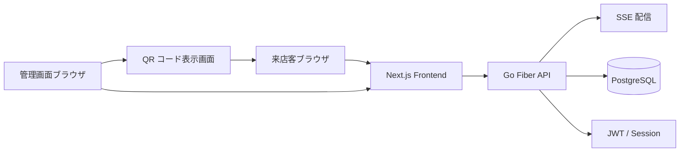
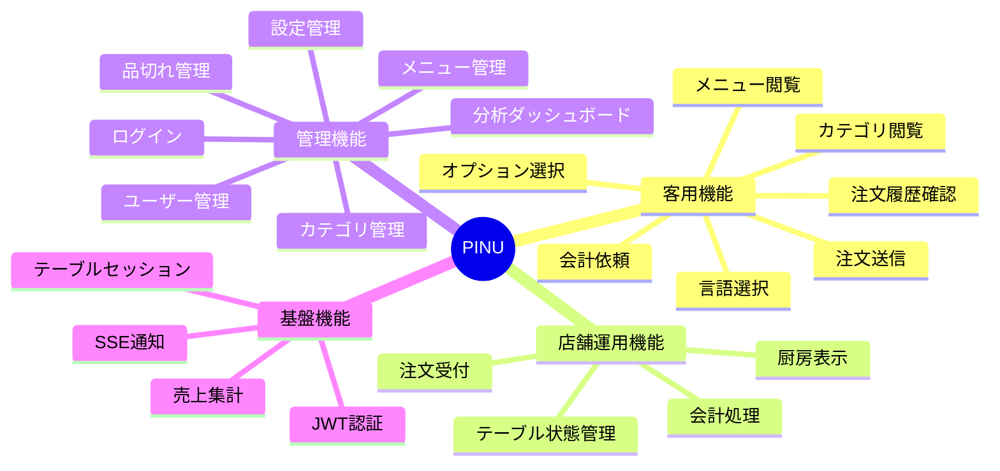
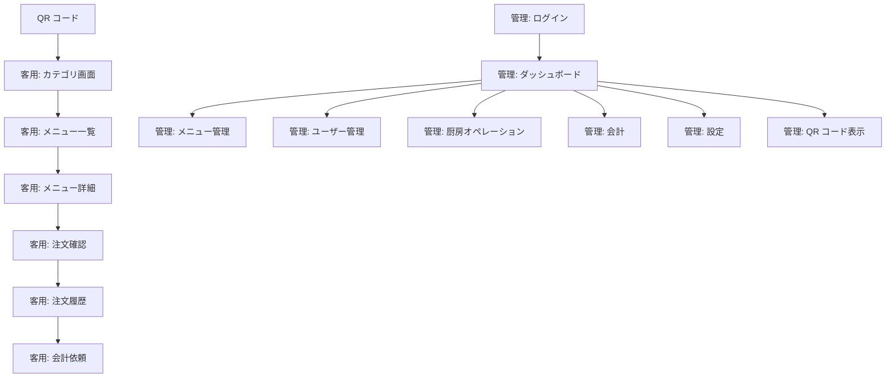
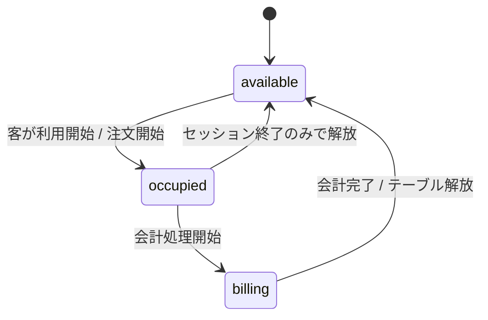
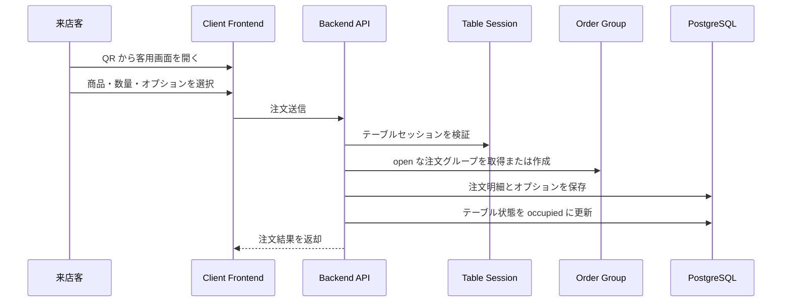
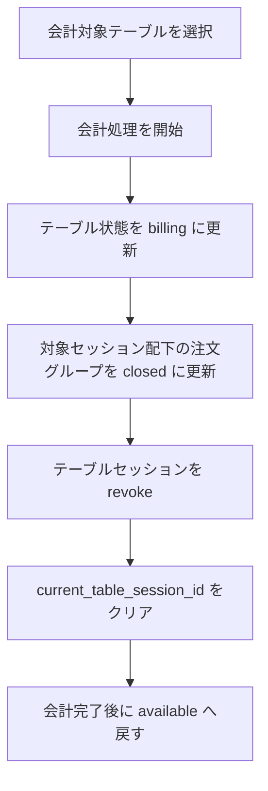
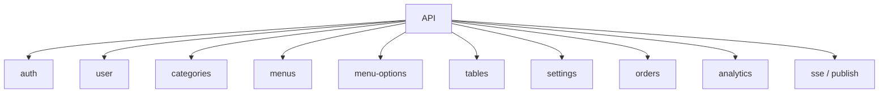
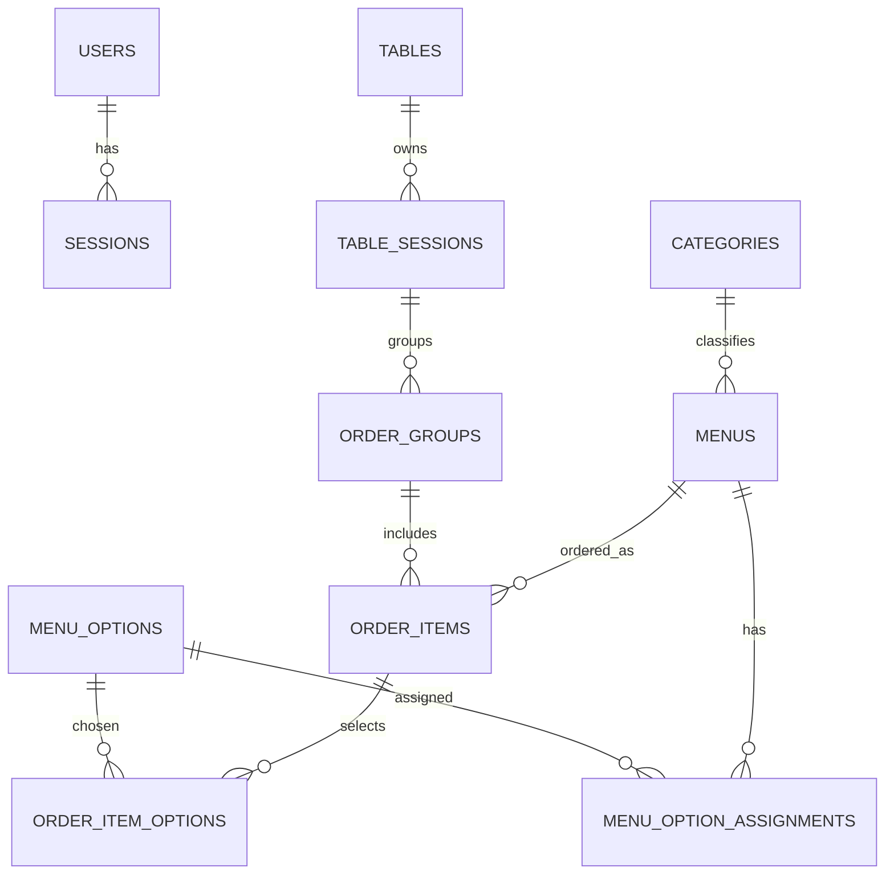

# PINU システム仕様書

## 1. 目的

本書は、PINU を同一仕様・同一技術スタックで再構築するための正式な仕様書です。  
既存実装・既存ドキュメント・データ構造をもとに、再構築対象の仕様を整理します。

## 2. システム概要

PINU は、小規模飲食店向けの QR オーダーシステムです。  
来店客はテーブルごとの QR コードから注文画面にアクセスし、店側は管理画面から注文受付・会計・メニュー管理・分析を行います。

### 2.1 解決する課題

- 店主が客席を巡回して注文を取る負担を減らす
- 注文到着を即時に把握できるようにする
- テーブルごとの利用状況と会計状態を一元管理する
- メニュー更新や売上確認を店側で完結できるようにする

### 2.2 提供チャネル

- 客用画面（スマートフォン想定）
- 管理画面（店舗スタッフ向け）
- 厨房オペレーション画面
- 会計画面
- QR コード表示画面

## 3. 利用者と権限

| 利用者 | 主な目的 | 主な操作 |
| --- | --- | --- |
| 来店客 | 注文と会計依頼 | カテゴリ閲覧、メニュー選択、オプション選択、注文履歴確認、会計依頼 |
| 店舗スタッフ | 店舗運営 | 注文確認、会計処理、テーブル状態更新 |
| 管理者 | 設定・管理 | ログイン、ユーザー管理、メニュー管理、カテゴリ管理、設定変更、分析確認 |

## 4. システム構成

### 4.1 採用技術スタック

| レイヤー | 技術 |
| --- | --- |
| フロントエンド | Next.js / React / TypeScript / pnpm |
| UI | Tailwind CSS / workspace UI package |
| バックエンド | Go / Fiber |
| データアクセス | Bun |
| データベース | PostgreSQL |
| 認証 | JWT (HS256) + Refresh Session |
| 通知 | SSE |
| 開発運用 | Task / Docker Compose |

### 4.2 バックエンド構成方針

- DI コンテナで依存解決を行う
- `routes -> handlers -> usecases -> repositories` の責務分離を維持する
- 複数更新が必要な処理は `UnitOfWork.Run` でトランザクション管理する

## 5. 機能仕様

### 5.1 機能マップ

### 5.2 客用機能

1. QR コードから客用画面へ遷移できる
2. カテゴリ単位でメニューを閲覧できる
3. メニュー詳細画面で商品情報を確認できる
4. メニューオプションを選択して注文できる
5. 注文履歴を確認できる
6. 会計依頼を送信できる

### 5.3 管理機能

1. 管理者はログインできる
2. ユーザーの登録・更新・削除・一覧表示ができる
3. カテゴリの登録・更新・削除・一覧表示ができる
4. メニューの登録・更新・削除・カテゴリ別表示ができる
5. メニューオプションの登録・更新・削除ができる
6. 店舗設定を参照・更新できる
7. KPI、日次売上、カテゴリ別売上、トップメニューを確認できる

### 5.4 店舗運用機能

1. 注文をリアルタイムに受信できる
2. 厨房画面で注文一覧を確認できる
3. 会計対象テーブルを一覧できる
4. テーブル単位で会計処理を実行できる
5. テーブル状態を `available / occupied / billing` で管理できる

## 6. 画面仕様

### 6.1 画面遷移概要

### 6.2 画面一覧

| 区分 | 画面 |
| --- | --- |
| 客用 | 言語選択、カテゴリ一覧、メニュー一覧、メニュー詳細、注文確認、注文履歴、会計依頼 |
| 管理 | ログイン、ダッシュボード、ユーザー管理、メニュー管理、カテゴリ管理、設定 |
| 店舗運用 | 厨房オペレーション、会計、テーブル状態管理、QR コード表示 |

## 7. 業務フロー

### 7.1 テーブル状態遷移

### 7.2 注文フロー

### 7.3 会計フロー

## 8. 認証・セッション仕様

### 8.1 管理者認証

- 管理画面はログインを必要とする
- アクセストークンは JWT を使用する
- リフレッシュトークンはサーバー側セッションとして保持する
- セッションは失効・削除できる

### 8.2 テーブルセッション

- テーブルごとに `table_session_id` を持つ
- テーブルセッションは有効期限を持つ
- 注文時はテーブルセッションの存在・失効状態・有効期限を検証する
- 会計時は対象テーブルのセッションを revoke する

## 9. API 仕様概要

### 9.1 API リソース

| リソース | 主な役割 |
| --- | --- |
| `/api/auth` | ログイン、ログアウト、トークン更新、セッション失効 |
| `/api/user` | ユーザー管理 |
| `/api/categories` | カテゴリ管理 |
| `/api/menus` | メニュー管理 |
| `/api/menu-options` | メニューオプション管理 |
| `/api/tables` | テーブル管理、会計処理 |
| `/api/settings` | 設定管理 |
| `/api/orders` | 注文登録、注文一覧取得 |
| `/api/analytics` | KPI、売上分析、メニュー分析 |
| `/api/sse` | リアルタイム通知受信 |

### 9.2 API 構成図

## 10. データ仕様

### 10.1 主要エンティティ

### 10.2 主要テーブル

| テーブル | 用途 |
| --- | --- |
| `users` | 管理ユーザー情報 |
| `sessions` | 管理ユーザーのリフレッシュセッション |
| `categories` | カテゴリ情報 |
| `menus` | メニュー情報 |
| `menu_options` | オプション情報 |
| `tables` | 物理テーブルと現在状態 |
| `table_sessions` | テーブル利用セッション |
| `order_groups` | セッション単位の注文グループ |
| `order_items` | 注文明細 |
| `order_item_options` | 注文時に選択したオプション |
| `settings` | 店舗設定 |

### 10.3 状態管理

| 種別 | 値 |
| --- | --- |
| テーブル状態 | `available`, `occupied`, `billing` |
| 注文状態 | `pending`, `preparing`, `served`, `cancelled` |
| 注文グループ状態 | `open`, `closed`, `cancelled` |

## 11. 非機能要件

### 11.1 操作性

- 高齢の店主でも直感的に操作できる UI とする
- 注文から会計までの操作手順は短く保つ
- 画面ごとの情報量は過多にしない

### 11.2 性能・拡張性

- 注文通知はリアルタイムに反映する
- 集計処理は分析用ビューの利用を前提とする
- 注文、会計、テーブル更新は整合性を保つ

### 11.3 セキュリティ

- 認証は JWT の署名検証を必須とする
- パスワードはハッシュ化して保存する
- シークレットは環境変数で管理する
- SQL はクエリビルダ経由で扱う

## 12. 開発・運用仕様

### 12.1 標準コマンド

| 対象 | コマンド |
| --- | --- |
| 全体セットアップ | `task setup` |
| 全体起動 | `task start` |
| 全体ビルド | `task build` |
| バックエンドテスト | `cd backend && go test ./... -v` |
| フロントエンド Lint | `cd frontend && pnpm lint` |
| フロントエンドビルド | `cd frontend && pnpm build` |

### 12.2 実行環境

- バックエンドエントリポイントは `backend/app/cmd/main.go`
- フロントエンドは単一 Next.js アプリとして `frontend/` 配下で運用する
- DB は PostgreSQL を Docker Compose で起動する

## 13. 再構築時の実装原則

- 本仕様を正として再構築する
- 技術スタックは既存構成を踏襲する
- ドメイン責務とユースケース責務を分離する
- テーブル状態、テーブルセッション、注文グループの整合性を最優先で扱う
- 客用導線と管理導線を同一フロントエンド内で明確に分離する
