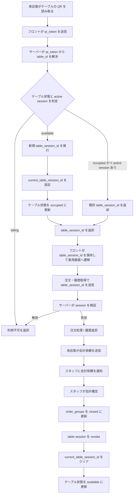

# セッション管理フロー図

- QR コードは固定のテーブル識別子であり、読み取り成功時にサーバーが `table_session_id` を新規発行または再利用します。
- テーブル状態は `available` → `occupied` → `billing` → `available` を基本サイクルとします。
- 専用の heartbeat API は設けず、`last_used` はテーブルセッション参照、注文、会計依頼などの成功時に更新します。
- 会計依頼はスタッフへの通知イベントであり、会計確定時に `table_session_id` を revoke します。
